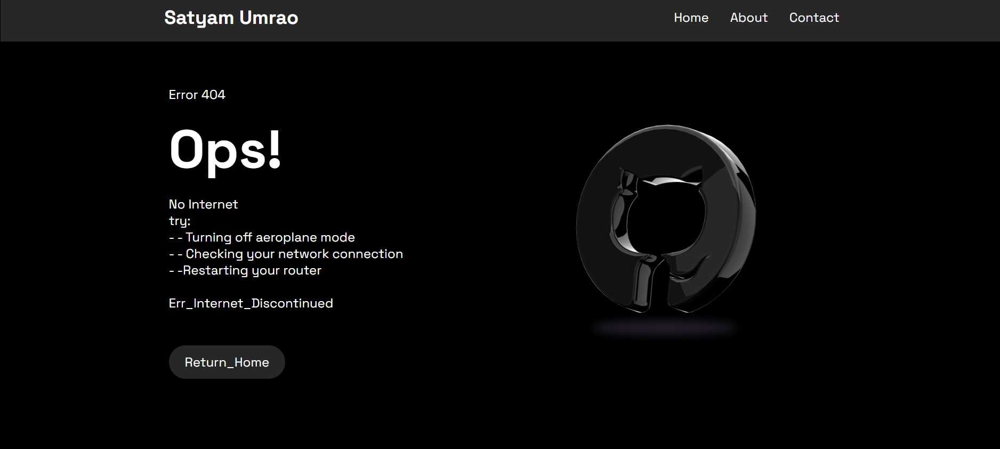

# GitHub 404 Error Page

A custom **404 error page** designed to replace the default "Page Not Found" screen on GitHub Pages. This project adds a creative and user-friendly touch to missing pages on your GitHub Pages website.

🚀 **Live Demo**: [View the 404 Page](https://satyam-umrao.github.io/Github_Err_404_new/)

---

## 📌 Features

- Custom and creative design
- Responsive layout for all screen sizes
- Simple and lightweight HTML/CSS/Javascript
- Works seamlessly with GitHub Pages

---

## 📁 Project Structure

Github_Err_404/ ├── 404.html # Main error page ├── style.css ├──Javascript └── assets/ # (Optional) Images, icons, or fonts

---

## 🛠️ Usage

To use this custom 404 page on your GitHub Pages site:

1. Copy the `404.html` file (and any related CSS/assets) into the root of your GitHub Pages repository.
2. Push the changes to your repository.
3. GitHub will automatically display your custom `404.html` for broken or missing links.

---

## 📷 Preview

 <!-- Replace with an actual preview image if available -->

---

## 📄 License

This project is licensed under the [MIT License](LICENSE).

---

## 🙋‍♂️ Author

**Satyam Umrao**

- [GitHub](https://github.com/satyam-umrao)
- [Portfolio](https://satyam-umrao.github.io)

Feel free to ⭐️ this repo if you found it helpful or use it in your own projects!
